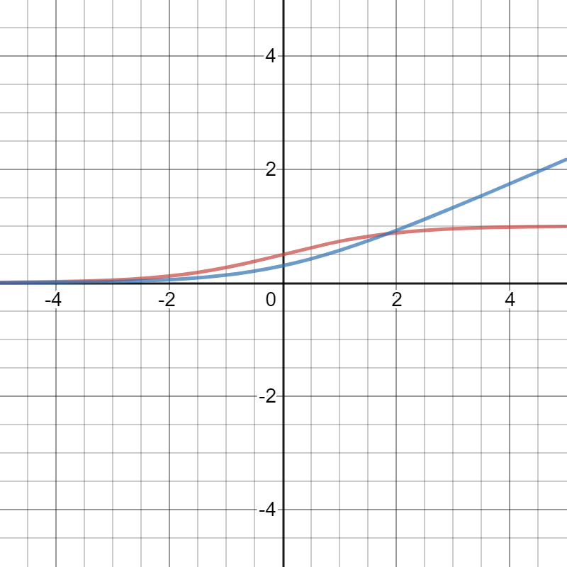
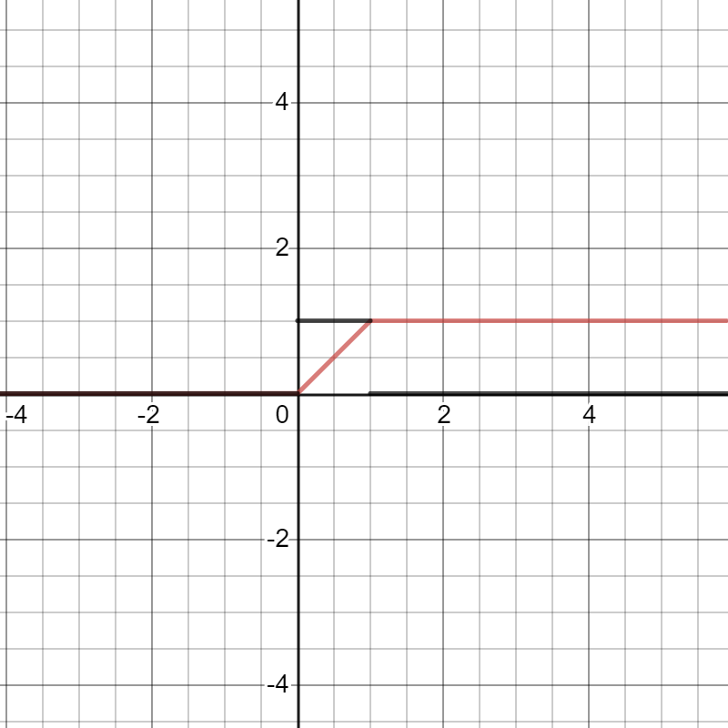

# Chapter 3: Probability and Information Theory 

- **Probability theory** is a mathematical framework to represent uncertain statements. Quantifying uncertainty and axioms to come up with new uncertain statements. *Extension of logic to deal with uncertainty.*

  >Logic provides a set of formal rules for determining what propositions are implied to be true or false given the assumption that some other set of propositions is true or false. 
  >
  >Probability theory provides a set of formal rules for determining the likelihood of a proposition being true given the likelihood of other propositions.  
  
- It has two uses in AI

  - Laws of probability tell how AI system should reason i.e. AI systems approximate expressions that are derived via probability theory 
  - It gives tool for theoretically analyzing behavior of AI systems.

- **Information theory** is a framework to quantify uncertainty in a probability distribution. 

### Uncertainty 

Beyond mathematical statements, everything is uncertain. There are three main sources of uncertainty:

1. Uncertainty in the system being modeled
2. Incomplete observability: when we can not completely observe the system
3. Incomplete modeling: when we are using an approximate model which should  discard some information. 

Sometimes it is useful to have a simple system with uncertainties rather than a complex but certain system. For example, uncertain and simple system: birds fly; certain and complex system: birds fly except young, injured, non-flying species ...

Probability have two main streams

- **Frequentist**:  Where probability represents frequency of events i.e. coin tosses 
- **Bayesian**: Where probability represents degree of belief i.e. how likely is for you to have corona.

> If we list several properties that we expect common sense reasoning about uncertainty to have, then the only way to satisfy those properties is to treat Bayesian probabilities as behaving exactly the same as frequentist probabilities.  

### Random Variables 

A measure-able function to map sample space to measure-able space. $X: \Omega\rightarrow E$

- Sample space ($\Omega$) : all the possible outcomes e.g. coin toss sample space $\{\phi, head, tail\}$
- Event Space ($\cal{F}$): all possible events e.g.  $\{ \{ \}, \{head\}, \{tail\}, \{head, tail\}\}$

### Probability Functions 

- A function that maps states of random variable to their probabilities: $f(x): \cal{F} \rightarrow [0,1]$
- **Basic Axioms**: For a function to be a valid probability function, it must full fill three properties:
  
  1. Its domain should be all the possible states of random variable. 
  2.  its range should be between 0 and 1.
  3. Normalized: Summation of all the probabilities (integral for continuous variable ) should be 1.
- PMF ($P(x)$) for discrete r.v.s and PDF ($f(x)$) for continuous  r.v.s
- PDF represents probability of landing in a region rather than a specific state.
- **Joint Probability Function**: Probability function can act on any number of r.v.s i.e. $P(X=x, Y=y, Z=z)$

- **Marginal Probability**: Probability of a subset of r.v.s from joint probability function. Computed via summing (integral) over all variables except subset. 

- **Conditional Probability**: Probability of one event given that another occurred.
  $$
  P(Y=y | X=x) =  \dfrac{P(X=x, Y=y)}{P(X=x)}
  $$

- **Chain Rule of Conditional Probability**: Joint probability of many variables can be decomposed into conditional probability over one variable. 
  $$
  P(x^{(1)},..., x^{(n)}) = P(x^{(1)}) \prod_{i=2}^n P(x^{(i)}|(x^{1},..., x^{(i-1)}))
  $$

- **Independence**: $x \bot y$ iff $P(x,y)=P(x)P(y)$

- **Conditional Independence**: $x\bot y \mid z$ iff $P(x=x,y=y,z=z) = P(x \mid z=z)P(y \mid z) = P(x=x, y=y \mid z=z)$

- **Expected Value**: Mean value f takes when x is drawn from P: $\mathbb{E}_{x \sim P} = \sum_x f(x)P(x)$
  Expected values are linear

- **Variance**: How much values of f varies from expected values on average: $Var(f(x)) = \mathbb{E}[(f(x)- \mathbb{E}[f(x)])^2]$

- **Covariance**: Measures some notion of linear dependence of two r.v.s. If +ive, increasing one r.v. also mean increasing other, negative means increasing one mean other decreases and =0 means linear dependence. 
  $$
  Cov(f(x), g(y)) = (f(x)-\mathbb{E}[f(x)]).(g(y) - \mathbb{E[g(y)]})
  $$

  - $Cov(x,y)=0$ means linear independence however they can exist non-linear dependence between two variables:
   $Independence \implies Cov(x,y)=0$ but $Cov(x,y)=0 \not \implies independence $
  
-  **Correlation**: Normalizes covariance to find how much two variables are related linearly.  It is not affected by scale as contribution of each variable is normalized.
  $$
  \rho_{x,y} = \dfrac{ 1}{\sigma_x \sigma_y} (x-\mathbb{E}[x]).(y - \mathbb{E[y]})
  $$

### Common Probability Distributions

A distribution function means defining distribution for all the possible values an r.v. can take. It is not always easy to do this manually. so we find common distribution functions that can define this.

#### Bernoulli Distribution 

Probability of a binary random variable taking one value or other: $P(x=1) =\phi $ and $P(x=0)=1-\phi$ or $P(x=x)= \phi^x (1-\phi)^{1-x}$

**Bernuli Experiment**: An experiment with two possibilities, success or failure. 

#### Multinoulli or Categorical Distribution 

Describes probability for a random variable with $k$ states i.e. $x\in \{0,1\}^k$ and probability is defined by $\vec{p} \in [0,1]^{k-1}$ and $1^T\vec{p}$ for each value in support of x.

> The Bernoulli and multinoulli distributions are sufficient to describe any distribution over their domain.  

#### Multinomial Distribution 

 Generalized form of Multinoulli distribution where $x\in \{0,1,2,...n\}^k$

> The [Bernoulli distribution](https://en.wikipedia.org/wiki/Bernoulli_distribution) models the outcome of a single [Bernoulli trial](https://en.wikipedia.org/wiki/Bernoulli_trial). In other words, it models whether flipping a (possibly [biased](https://en.wikipedia.org/wiki/Fair_coin)) coin one time will result in either a success (obtaining a head) or failure (obtaining a tail).
>
>  The [binomial distribution](https://en.wikipedia.org/wiki/Binomial_distribution) generalizes this to the number of heads from performing *n* independent flips (Bernoulli trials) of the same coin. 
>
> The multinomial distribution models the outcome of *n* experiments, where the outcome of each trial has a [categorical distribution](https://en.wikipedia.org/wiki/Categorical_distribution), such as rolling a *k*-sided dice *n* times.
>
>  (Wikipedia)

#### Gaussian Distribution 

Most famous distribution over real numbers described by:

For $x \in \mathbb{R}^n$

- In the absence of prior knowledge, we can assume an r.v. to take normal r.v. for two reasons:
  
  1. According to *Central Limit Theorem*, sum of many independent r.v.s approximately follow Normal distribution.
  
     > This means that in practice, many complicated systems can be modeled successfully as normally distributed noise, even if the system can be decomposed into parts with more structured behavior  
  
  2.  > Out of all possible probability distributions with the same variance, the normal distribution encodes the maximum amount of uncertainty over the real numbers  
      >
      > **We can thus think of the normal distribution as being the one that inserts the least amount of prior knowledge into a model.  **

#### Exponential and Laplace Distributions  

If we want a probability distribution with a sharp point at 0, 
$$
P(x=x; \lambda) = \lambda.\vec{1}_{x\geq0} e^{-\lambda.x}
$$
if we want to have sharp point at arbitrary point $\mu$
$$
P(x=x; \mu, \gamma) = \dfrac{1}{2\gamma} e^{\dfrac{-|x-\mu|}{\gamma}}
$$
A Laplacian distribution with $\gamma=2, \mu=1$

#### Dirac Distribution 

If we want a distribution to have maximum mass at point $\mu$ and zero everywhere else,
$$
p(x) = \delta(x-\mu) 
\\p(x) = 1 \text{  if  } x=\mu, 0 \text{ otherwise }
$$

#### Mixture Distribution 

A mixture distribution is combination of many component distributions where on each trail, we first determine component distribution by sampling it from multinoulli distribution i.e.
$$
P(x) = \sum_i P(c=i)P(x|c=i)
$$
Where $P(c)\sim multinouli()$

#### Gaussian Mixture Distribution (Model)

In Gaussian mixture model, each component of mixture distribution is a Gaussian random variable with variables: $P(x \mid c=i)\sim \mathcal{N}(\mu_i,  \sigma^2_i)$ and each component follows a multinoulli distribution. We can also constrain the components of mixture model i.e. all sharing covariance via $\Sigma^{(i)} = \Sigma \text{   } \forall_i $ etc. 

A gaussian mixture model can approximate any smooth distribution with specific non-zero error.

>A Gaussian mixture model is a universal approximator of densities, in the sense that any smooth density can be approximated with any specific nonzero amount of error by a Gaussian mixture model with enough components.  

### Important Functions 

**Sigmoid Function**: To get probabilities as its range is $[0, 1]$. It is defined as 
$$
\sigma(x) = \dfrac{1}{1+e^{-x}}
$$
$\color{Blue} Blue$: $\sigma(z)=\dfrac{1}{1+e^{-z}}$

$\color{red}Red$: $\dfrac{d(\sigma(z))}{dz} = \dfrac{0 - \dfrac{d}{dz}(1+e^{-z})}{(1+e^{-z})^2} = \dfrac{e^{-z}}{(1+e^{-z})^2}$
See plot at: https://www.desmos.com/calculator/fv0jjqr3g1

**Softplus Function**: Smooth version of positive part function ($x^+ = max(0,x)$), having range $(0,\infty)$:

$\color{Blue} Blue: sf(z) = \log(1+e^z)$

$\color{red}Red: \dfrac{d sf(z)}{dz}) = \dfrac{\dfrac{d}{dz}(1+e^z)}{1+e^z}= \dfrac{e^z}{1+e^z} = \dfrac{1}{1+e^{-z}}$ i.e.  sigmoid

see plot: https://www.desmos.com/calculator/subn8luwgc

**Min-Max Function**

$mmx(x) = \max(0, \min(x))$

See plot: https://www.desmos.com/calculator/bwcvnotune

**Important Properties of these functions**:

1. $\sigma(x) = \dfrac{e^x}{1+e^x}$ 
2. $\sigma(x) = 1-\sigma(-x)$ $\implies$$\dfrac{1}{1+e^{-x}}= 1-\dfrac{1}{1+e^{x}} $ 

3. $\dfrac{d\sigma(x)}{dx} = \sigma(x) (1-\sigma(x))$ 
4. $\dfrac{dsf(x)}{dx} = \dfrac{e^x}{1+e^x} = \sigma(x)$
5. $\log(\sigma(x)) = sf(-x)$

### Bayes Rule

$$
P(x|y) = \dfrac{P(y|x).P(x)}{P(y)}
$$

where $P(y) = \sum_x P(y \mid x)P(x)$

### Important Concepts from Measure Theory 

Important concept from measure theory are results that may apply to most points in $\mathbb{R}^n$except a few points.

**Measure Zero**: Set of points that have take zero volume in the space we are measuring i.e. line in 2D space

**Almost Everywhere**: A property that works for all points except a set of finite points which have measure zero. 

## Information Theory 

- Information theory deals with how much information a signal contains. The basic intution is that an event that is less likely to happen should convey more information. For example: "today sun rose from the west" gives us almost no information while "today there was a solar eclipse" gives us useful information.

- A function quantifying information must fulfill following properties:

  - A less likely event should entail more information and more likely event should entail less information 
  - An event guaranteed to happen should have zero information 
  - Information of two independent events should be additive. 

  $$
  I(x) = -log(P(x))
  $$

- Expected information in a probability distribution, also called Shanon Entropy, can be quantified as follows:
  $$
  H(x) = E_{x\sim P(x)}[I(x)] = -E_{x\sim P(x)}[log(P(x))] = -\sum_x x log(P(x))
  $$
  This gives us expected information in a event x sampled from P(x).

- **KL Divergence**: KL divergence is a way to find how different two distribution are which are defined on same random variable:
  $$
  KL(P, Q) = E_{x\sim P} log \dfrac{P(x)}{Q(x)}
  $$

  > The KL divergence is 0 if and only if P and Q are the same distribution in the case of discrete variables, or equal “almost everywhere” in the case of continuous variables  

- KL divergence is not a true distance measure as $KL(P,Q) \neq KL(Q,P)$.  Asymmetry also means consequences based on which direction we use. Following figure is an example:
  
  *A mixture of Gaussian approximated by single Gaussian distribution but minimization is done in two directions. *

