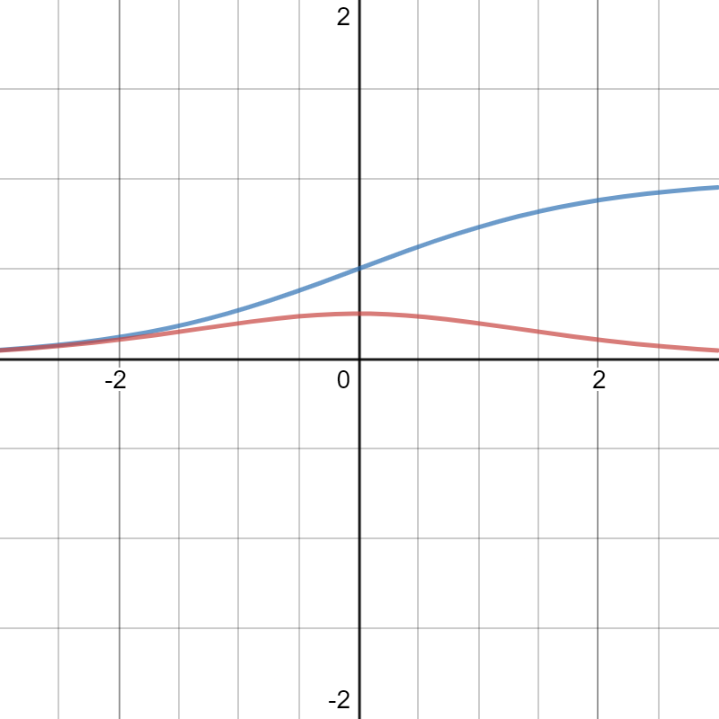

-Deep learning can do most tasks that consists of mapping input to output vector which a person can do rapidly given large enough data and model.

# Deep Feedforward Neural Networks 

Feedforward neural networks are function approximators consisting of many hidden layers. Given labelled data (x, y), FNN's goal is to approximate a function $f^*(x)$ via $f(x; \theta)$ where $\theta$ is learned. The approximation is done via assuming that data is generated by  $y\approx f^*(x)$. They consists acyclic graph and of many layers so output of a NN is: $y =f^3(f^2(f^1(x)))$. They are feedforward as there is not feedback loop unlike recurrent neural networks. 

> The training examples specify directly what the output layer must do at each point x; it must produce a value that is close to y. The behavior of the other layers is not directly specified by the training data. The learning algorithm must decide how to use those layers to produce the desired output, but the training data do not say what each individual layer should do.   

> It is best to think of feedforward networks as function approximation machines that are designed to achieve statistical generalization, occasionally drawing some insights from what we know about the brain, rather than as models of brain function.  

We can think of DNNs in terms of linear model. A linear models maps input $x$ to output $y$: $y=x^Tw$. However, these models have limited representational power. Instead of using $x$, we can apply a non-linear transform on $x$: $\phi(x)$. We have three options for $\phi$.

1. Use very generic $\phi$: infinite dimensional that is simply used by kernel machines. If $\phi$ has high enough dimensions, we can always fit training data. However, generalization remains poor. 
2. Use handcrafted $\phi$ but it takes a lot of time and effort of humans.
3. Use a strategy to learn $\phi$ and then uses it as follows: $y=\phi(x)^Tw$. We can also encode prior knowledge via regularization. The approach is very generic as we can use families of $\phi$ that we expect to perform good. 

### Example: Learning XOR

Lets assume that we are interested in learning a function $f$ that can represent XOR operation. Also assume that we are only interested in generalization in training part only i.e. $X \in {[0,0]^T, [0,1]^T, [1,0]^T ,[1,1]^T }$ and we want to learn $f(x, \theta)$ that can represent this function. Lets assume the MSE loss function i.e. 

$$J(\theta) = \dfrac{1}{4} \sum_0^3 (y-f(x, \theta))$$

#### Linear Model vs Neural Network 

##### Linear Model

First let's assume the model to be linear:

$f(x, w,b)= x^Tw +b$  

We can minimize cost via a closed form by solving normal equations. With that, we get $w=0$ and $b=\dfrac{1}{2}$. However, this function can not represent a XOR. 

##### Neural Network

Now, let's take a two layer neural network. It can be formulated with following: $h = w_1^Tx+b_1$ and $y=w_2^Th+b_2$ or $f(x, \theta) = f^1(f^2(x))$. However, this is similar to linear model as output can be represented via: $y = w_2^T(w_1^Tx+b_1)+b2 = Wx +b$. We need to add non-linearity to describe the features. In neural nets, we can do this via following: $h = g(w_1^Tx+b_1)$ where g is ReLU which is: $g(z) = \max(0, z)$ and it is applied element wise.

>The function remains very close to linear, however, in the sense that it is a piecewise linear function with two linear pieces. Because rectified linear units are nearly linear, they preserve many of the properties that make linear models easy to optimize with gradient-based methods. They also preserve many of the properties that make linear models generalize well. A common principle throughout computer science is that we can build complicated systems from minimal components. Much as a Turing machine’s memory needs only to be able to store 0 or 1 states, we can build a universal function approximator from rectified linear functions.

The complete network is: $w_2^T. \max(w_1^Tx+b_2)+b_1$.  In this model, we first transform the input into a space where it is linear and then we apply a linear model on that space as shown in the following figure:

### Gradient Based Learning 

We can get exact solutions of linear models, however, this is not possible for neural networks with possibly billions of parameters. For this, we use gradient descent. Gradient descent converges in the case of convex optimization with any initialization (in theory, it may face some numerical problems). For neural networks with interesting loss function, the optimization becomes non-convex and the there is no guarantee for convergence with stochastic gradient descent. However, it works well in practice. It depends on initial values as well. 

Lets review design considerations for neural networks. 

#### Cost Functions 

Our parametric model defines distribution $p(y|x; \theta)$ and we simply use principle of maximum likelihood i.e. minimize cross entropy between training data and model's prediction. 

Some time we take simple approach where we simply predict a statistic over $y$ instead of entire probability distribution. Specialized cost function enable us to train such predictor. 

The total cost function is always a primary cost function and a regularizer term.

##### Learning Conditional Distributions with Maximum Likelihood

Most modern NNs are trained with maximum likelihood i.e. cross entropy between model distribution and training data:

$$-\mathbb{E}_{x, y \sim \hat{p}_{data}} [\log(p_{model}(y|x))]$$

Specific form depends on model to model i.e. on $p_{model}$. Expansion of the cost function often give us cost that depends on model and constant factor.  For instance, if $p_{model}(y|x) = \mathcal{N}(y; f(x;\theta, I))$  then we get mean square error:
$$J(\theta) = \dfrac{1}{2} ||y-f(x;\theta)||^2 + const$$

Discarded portion is based on variation of model which we are not parametrizing.

> Previously, we saw that the equivalence between maximum likelihood estimation with an output distribution and minimization of mean squared error holds for a linear model, but in fact, the equivalence holds regardless of the f(x; θ) used to predict the mean of the Gaussian  

Specifying maximum likelihood means the burden of designing cost function is no more on us for each model. Specifying a model $p(y|x)$ mean cost function is $-\log(p(y|x))$.

1. One important point in gradient learning is that gradient should be large and predictable enough to guide the learning process. Functions that saturate (becomes flat) does not work well with this objective. Negative log likelihood helps to avoid this issue. For instance, functions involving exp function can saturate but log can undo the exp of some units. 
2. Cross Entropy usually don't have minimum value for commonly used models. For discrete output variables, most models are parametrized in such a way that they can not represent probability of zero or one and only can go very close to it. 

##### Learning Conditional Statistics 

- Sometime we are only interested in a specific conditional statistic $y$ given $x$ instead of full conditional distribution $p(y|x)$, i.e. a function to predict mean of $y$.

- A sufficiently powerful neural network can represent any function $f$ from a wide class of functions (limited by some features like continuity and boundedness).  So we can think of neural network as a function (instead of specific set of parameters) and cost function as functional (a functional maps function to real number). This way learning becomes choosing a function. 

- From calculus of variations, we have following two results:

  $$f^* = \arg \min_{f} \mathbb{E}_{x,y \sim p_{data}} ||y - f(x) ||^2 $$
  
  yields 
  
  $$f^* = \mathbb{E}_{y\sim p_{data}(y|x)} [y]$$
  
  as long as this function is within class we optimize.  This mean given enough training data, minimizing mean squared cost would give a function that predicts the mean of $y$ for each $x$.
  
  $$f^* = \arg \min_{f} \mathbb{E}_{x,y \sim p_{data}} ||y - f(x) ||_1 $$
  
  yields a function that predict median of $y$ given $x$.
  
- Unfortunately, these two functions often lead to poor results with gradient based learning because some output units saturate and produce very small gradients. That's why cross entropy is famous even when we don't have to estimate entire distribution. 

#### Output Units 

- Cost function is coupled with choice of  output unit and choice of output unit decides form of cross entropy function.
- Principally, any output unit can also be used as hidden unit but here we are only interested in output.
- We assume that  neural network has given set of features $h = f(x; \theta)$ and role of output unit is to do additional transformation on the features to complete the task.

##### Linear Units with for Gaussian Output Distributions

- The most simple choice for output unit is linear i.e. $\hat{y} = W^Th + b$, also called linear units. 

- They are used to produce mean of conditional gaussian: $p(y|x) = \mathcal{N}(y; \hat{y}, I)$. Maximizing log likelihood is now minimizing mean squared error. 

- Linear units don't saturate and they pose little difficulty for gradient based learning and can be used with wide variety of optimization algorithms. 

#### Sigmoid Units for Bernoulli Distribution 

- Many tasks require  predicting value of a variable $y$ i.e. binary classification. The maximum likelihood way is to define Bernoulli Distribution over $y$ conditioned on $x$ which is a single number. Neural net needs to predict one number: $p(y=1|x)$, which need to be in the interval [0,1].

##### Why we should use Maximum Likelihood with Sigmoid

- One simple option is to use following function which  converts the output into required range:

  $$f(x) = \max(0, \min(1, w^Tx+b))$$

  However, it has zero gradients all over except $(0,1)$ which means we gradient based learning don't have guide on how to improve corresponding parameters. (red f(x) and black gradient)
  

- We want to use an approach that make sure that there is a strong gradient whenever our algorithm gives wrong answer. 

  Let's assume that $\hat{P}(y)$ is unnormalized probability distribution then:

  $$\log \hat{P}(y) = y.z $$

  $$\hat{P}(y) = \exp(yz) $$

  $$P(y) = \dfrac{\exp(yz)}{\sum_{i=0}^1 exp(y^i z)}  $$

  $$P(y) = \sigma((2y-1)z)$$

  z is often called logits. The log in maximum likelihood undo exp of sigmoid. If we use maximum likelihood, we can write cost as:
  $$
  J(\theta) = - \log P(y|x) \\
  = - \log (\sigma(2y-1)z)  \\
  = sf((1-2y)z)
  $$
  Following is the plot of $\color{blue}soft plus$$(\log(1+e^x))$ and its $\color{red}gradient $. 

  

Gradient of $J(\theta)$ should be positive whenever model has wrong answers and near 0 otherwise.

1. Above-mentioned soft plus has saturated gradient (near zero) whenever answer is negative. The output of softplus is negative whenever both y and z have same signs (i.e. model has right answer) e.g. y=+1, z=+1 ==> (1-2)(1) = -1 or  y=-1, z=-1 ==> (1+2)(-1) = -3.

2. Softplus has $sign(z)$ gradient whenever soft-plus is on positive side. When y and z have different signs (i.e. model is wrong)e.g. $y=+1, z=-1$ means $sf((1-2)(-1)) = +1$ which is in the positive side where gradient is sign(z). This means gradient based learning can act to correct whenever model prediction is wrong.   

On the other hand, mean square loss can saturate anytime $\sigma(z)$ saturates because gradient of sigmoid goes to zero if z is too negative or too positive. $\color{blue} \sigma(z)$ and its $\color{red} gradient$.

 

>In software implementations, to avoid numerical problems, it is best to write the negative log-likelihood as a function of z, rather than as a function of $\hat{y} = σ(z)$. If the sigmoid function underflows to zero, then taking the logarithm of $\hat{y}$ yields negative infinity.  

#### Softmax for Multinoulli Output Distribution 

We use softmax when we want to model discrete probability over $n$ possible values. In this case, we want to produce a vector $\hat{y}$ such that $\hat{y}_i = P(y=i, x)$ (between 0 and 1) and sum of $\hat{y}$ is one. First a linear layer gives us un-normalized probability or log probability or logits: $ z = W^Th +b$ where $z_i = \log \hat{P}(y=i|x) $.

**The soft max**
$$
softmax(z_i) = \dfrac{\exp(z_i)}{\sum_{j} \exp(z_j)}
$$
**Softmax after Max-Likelihood Cost Function:** Exponent works well when we use max likelihood because it undo the log of cost function. Consider log the softmax:
$$
\log softmax(z)_i = z_i - \log \sum_j z_j
$$

- This means that $z_i$ will always have a direct contribution and it will avoid the saturation of log-softmax which in turn will also avoid gradient going to zero even when second term is very small.

- When we maximize log-softmax, we push first term up and push all other terms down. We can approximate second term: $\log \sum_j z_j \approx \max_j z_j$. This means that maximum likelihood will penalize most active term in $\log \sum_j z_j$ 

- If $z_i$ (correct probability) is high than $max_j z_j \approx  z_i$ and this will cancel overall value e.g. $z_i - z_i$, and this *example will contribute small in the overall loss function*. Cost function will be dominated by the examples that are yet incorrectly classified. 

- > Overall, unregularized maximum likelihood will drive the model to learn parameters that drive the softmax to *predict the fraction of counts of each outcome observed in the training set*:  
  > 

  

##### Why Softmax wouldn't work with other cost functions

If an objective function don't have log to undo the exp of SoftMax, it will not perform well because SoftMax saturates when difference between input is extreme which causes the gradient to be vanish and no useful learning can be derived from wrong or right predictions. 
>In particular, squared error is a poor loss function for SoftMax units and can fail to train the model to change its output, even when the model makes highly confident incorrect predictions (Bridle, 1990).  

Observe that adding a scalar value to SoftMax does not have an effect on overall results:

$$softmax(z) = softmax(z + c)$$

using this we can derive a numerically stable version:

$$\text{softmax}(z) = \text{softmax}(z - \max_i z_i)$$

##### Winner-Take-It-All

In softmax, increase in one unit's value means decrease in other units as sum is one. This is similar to inhabitation that exits  in nearby neurons in cortex. Similarly, when one $z_i$ is large it becomes winner-take-it all because one value would be close to one and all other values would be close to zero. 

**SoftArgMax**: Softmax is continuous and differentiable version of argmax and SoftMax is a bit misleading. The continuous version for max would be: $\text{softmax}
(z)^Tz$

#### Other Output Types

Neural network can generalize to any input layer we may wish and principle of maximum log likelihood ($-\log p(y|x; \theta)$)  provides a guide  to design a good cost function for any kind of output layer. 

We can think of neural networks as representing $f(x; \theta)$ and output of this is not direct predictions of $y$. Instead $w = f(x; \theta)$ which controls the distribution over y and our loss function can be defined: $-\log p(y; w(x))$. 

While deriving cost function and output layer, we need to keep following in mind:

1. gradients of multiplication , addition and log are well behaved 
2. gradients of division and square are not. Division has arbitrary steep gradients near zero and square have vanishing gradient near zero.
3. While large gradients are good for learning, arbitrarily large gradients usually result in instability. 

