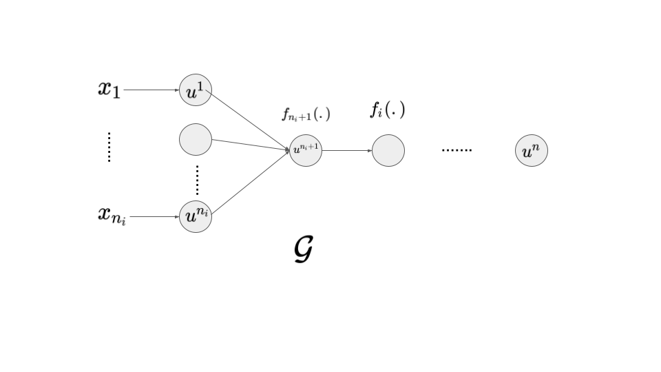
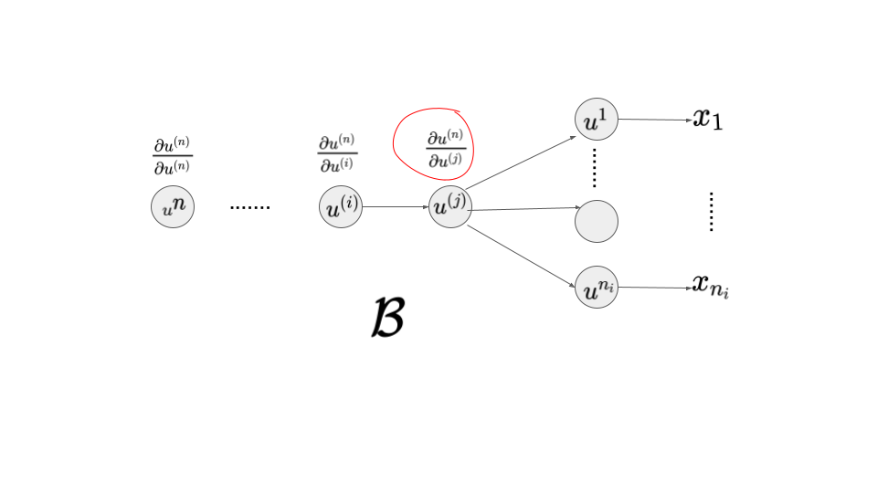

## Backpropagation and Other Differentiation Algorithms 

- **Forward Propagation** is to give neural network input $x$, propagate it through hidden units until it produces a scalar cost $J(\theta)$. **Backward Propagation (backprop)** is flow of information from cost back to input to compute gradients. A learning algorithm -- like stochastic gradient descent -- can use these gradients to update parameters for learning. This gradient can also be used for any other purposes other than learning as well.

- **Analytical Gradient** computation is straightforward but computationally expensive.  Backprop is simple and inexpensive in comparison. 

  A simple way to calculate analytical or numerical differentiation is to compute slope of two nearby points of a function i.e.:

  
  $$
  \dfrac{f(x+h)-f(x)}{h}
  $$
  
- Backprop can compute gradient of any function $\nabla_x f(\vec{x}, \vec{y})$  where $x$ is variable whose derivate is desired and $y$ is an additional set of variables whose derivative can be computed but not desired. Backprop through a network is very general and can be used to compute values such as the Jacobian of a function. 

### Computational Graphs 

- For backprop, we need to think of a network as a computational graph. 
  - Each node in the graph is a variable (scalar, vector, matrix, tensor or even any other type).
  - **Operation** is a simple function of one or more variables (functions, on other hand, can have multiple operations as well). We have a set of allowable variables.  For the sake of simplicity, here we are define an operation to return a single output variable. 
  - If a variable $y$ is computed by applying an operation to a variable $x$ then we draw an edge from $x$ to $y$. 


### Chain Rule of Calculus 

- With chain rule, we can compute derivate of functions formed by composing other functions whose derivative is known. Specifically, assume $x \in \mathbb{R}$ and $f, g$ be to functions that map a real number to a real number and $y=g(x)$, $z = f(y)$, then we can compute $\dfrac{dz}{dx}$ with following:
  $$
  \dfrac{dz}{dx} = \dfrac{dz}{dy}.\dfrac{dy}{dx}
  $$

- **Generalization Beyond Scalar**: Let $x \in \mathbb{R^m}$ , $y \in \mathbb{R^n}$ and $g: \mathbb{R^m} \to \mathbb{R}^n$ and $f: \mathbb{R^n} \to \mathbb{R}$, and $y = g(x)$ and  $z = f(g(x))$ then,
  $$
  \dfrac{dz}{dx_i} = \sum_{j=0}^n \dfrac{dz}{dy_j} . \dfrac{dy_i}{dx_i}
  $$
  and in vector notation, 

  

$$
\nabla_\bold{x} z = \bigg(\dfrac{\partial \bold{y}}{ \partial \bold{x} }\bigg)^T \nabla_{\bold{y}} z
$$

​		where $\dfrac{\partial  \boldsymbol{y}}{ \partial \boldsymbol{x} }$ is $n \times m $ Jacobian matrix of $g$. 

- This way,  can compute gradient of any variable w.r.t. $x$ by multiplying Jacobian matrix by gradient. 

- **Generalization to Three Operations**: 

  - Lets assume that $$ \boldsymbol{x} \in \mathbb{R}^n$$, $ \boldsymbol{y_1},  \boldsymbol{y_2} \in \mathbb{R}^{m_1}, \mathbb{R}^{m_2}$ and $z \in \mathbb{R}$ 
  - $ \boldsymbol{y}_1 = f_1( \boldsymbol{x})$, $ \boldsymbol{ \boldsymbol{y}_2} = f_2( \boldsymbol{y_1})$ and $z = f_3( \boldsymbol{y_2})$ and the  overall model is:

  $$
  z = f_3(f_2(f_1( \bold{x})))
  $$

  The derivative:
  $$
  \dfrac{dz}{dx_i} = \sum_{k=0}^{m_2} \sum_{j=0}^{m_1}  \dfrac{dz}{dy_2^{j}} . \dfrac{dy_2^{j}}{dy_1^{k}} .\dfrac{dy_1^{k}}{dx_i} \\ 
  \nabla_{\bold{x}} z = \bigg( \dfrac{\partial \bold{y_2} }{\partial \bold{y_1} } \bigg)^T . \bigg( \dfrac{\partial \bold{y_1} } {\partial \bold{x} } \bigg)^T \nabla_{\bold{y_2}} z
  $$

- BP is now applying this kind of chain rule to all the operations of a computational graph. 

- **Generalization to Tensor**: 


### Recursively Applying the Chain Rule to Obtain Backprop

#### Storing vs Re-Computing 

- Chain rule to write simple algebraic expression for scalar w.r.t any node of the graph is easy, however, evaluating it in computer is need extra considerations. 

- Many expressions are repeated, we need to decide whether to store them or re-compute several times. Storing them would increase memory size and re-computing them would cost extra computation.  

  **Example**: Consider following graph:

  
  
  Suppose that we want to compute $\dfrac{\partial z}{\partial w}$.  The output node is connected with input via following way: $z = f(f(f( w )))$ i.e. $f: \mathbb{R} \to \mathbb{R}$ is used three times or in other words:
  $$
  z = f(y) \\
  y = f(x) \\
  x = f(w)
  $$
  we can compute its gradient via following: 
  $$
  \dfrac{\partial z}{ \partial w} \\ 
  =\dfrac{\partial z}{ \partial y} . \dfrac{\partial y}{ \partial x} \\
  =\dfrac{\partial z}{ \partial y} . \dfrac{\partial y}{ \partial x} . \dfrac{\partial x}{ \partial w} \\
  \text{-} \\
  = f'(y) . f'(x) . f'(w) \\
  = f'(f(f(w))) . f'(f(w)) . f'(w)
  $$

- Last two equations suggest two possible strategies:
  - Second Last Equation: First compute $f(w)$ and store it in variable $x$, then compute $f(x)$ and store it in $y$ and so on. This is preferable when we want to reduce computation cost
  - Last Equation: Compute each function whenever required i.e. $f(w)$ is computed twice. This is preferable when we want to reduce memory 

#### Algorithm 

This algorithm is simple forward and backward prop without practical considerations like memory or computational budget. 

**Forward Propagation**: Consider a computational graph $\mathcal{G}$ describing scalar value $u^{(n)}$.

- The scalar $u^{n}$ is the output node 
- $u^1$  to $u^{n_i}$ nodes are input of the graph $\mathcal{G}$
- we want to calculate output ($u^n$)'s gradient w.r.t. to $n_i$ input nodes: $u^{1}$ to $u^{n_i}$ i.e. $\dfrac{\partial u^n}{\partial u^{i}} \text{ , }\forall_i \in \{1, ..., n_i\}$. 
- The graph $\mathcal{G}$ is ordered in such a way that we can compute of each node with the output of its predecessors starting at $u^{n_i+1}$ and up to $u^{n}$. 
- And each of these nodes computes following: 

$$
u^{(i)} = f(\mathbb{A^{(i)}})
$$

where $\mathbb{A^{(i)}}$ is set all nodes that are parents of $u^{(i)}$. We can think of $\mathcal{G}$ as forward \propagation. 


```latex
for i={1, ..., n_i} do
	$u^{i}$ <- $x_i$ \comment{set input to initial nodes}
end for
\text{compute and store intermediate nodes }	

for i={n_i +1 ,..., n} do 
	A^{(i)}  <- u^{(j)} \mid j \in Pa(u^{i}, j<i)
	u^{(i)}  <- f^{(i)}(x_{i})
end for

return u^{n}
```

**Backpropagation**: To perform backprop, lets have graph $\mathcal{B}$, which reverse order of $\mathcal{G}$ and each node computes derivative $\dfrac{\partial u^{(n)}}{\partial u^{(j)}}$ associated with forward graph node $u^{(i)}$. This id done using chain rule w.r.t. scalar output $u^{(n)}$. 
$$ {eq:backprop}
\dfrac{\partial u^{(n)}}{\partial u^{(j)}} = \sum_{i: j \in Pa(u^{(j)})}\dfrac{\partial u^{(n)}}{\partial u^{(i)}} \dfrac{\partial u^{(i)}}{\partial u^{(j)}}
$$
The subgraph $\mathcal{G}$ have exactly one edge for each edge from  node $u^{(j)}$ to $u^{(i)}$ in  $\mathcal{B}$.

Suppose that we already have derivative of $\dfrac{\partial u^{(n)}}{\partial u^{(i)}}$  w.r.t. node $u^{(i)}$and we now want to calculate derivative w.r.t. its parent node $u^{j}$ i.e.  $\dfrac{\partial u^{(n)}}{\partial u^{(j)}}$, then all we have to do is to calculate partial derivative  $\dfrac{\partial u^{(i)}}{\partial u^{(j)}}$ and do a dot product with the derivative of last node as shown in Equation $\ref{eq:backprop}$. This means the complexity increases linearly with number of nodes.



If each node is a vector then $\dfrac{\partial u^{(n)}}{\partial u^{(i)}}$ is a vector and $\dfrac{\partial u^{(i)}}{ \partial u^{(j)}}$ is matrix. So finding $\dfrac{\partial u^{(n)}}{ \partial u^{(j)}}$ consists of finding partial derivative and then multiplication and summation. 

```latex
\comment{Run forward pass to obtain activation of the network}
\comment{grad_table is a data structure that will store previous gradeints.}

grad_table[$u^{(n)}$] \goto 1
\for j=n-1 down to 1 do:
	grad_table[$u^{(j)}$] \goto $\sum_{i: j \in Pa(u^{(j)})} grad_table[u^{(i)}] \dfrac{\partial u^{(i)}}{\partial u^{(j)}}$
\endfor

return {grad_table[$u^{(i)} \mid i=1, ..., n$]}
```

### Forward and Backprop for a one layer MLP

TBD

### Symbol-to Symbol Derivatives 

- Algebraic expressions and computational graphs work on symbols. When we train a network, we replace these symbols with numeric values.

- **Symbol-to-Number Differentiation**: approach to backprop takes a graph and set of values associated with the graph and return numerical values, used by Torch and Caffe.

- **Symbol-to-Symbol Differentiation**:  approach is to take a computational graph and add additional nodes to the graph that provides a symbolic description of desired derivatives, used by TensorFlow and Theano. 

  >*In this approach, the back-propagation algorithm does not need to ever access any actual specific numeric values.* Instead, it adds nodes to a computational graph describing how to compute these derivatives. A generic graph evaluation engine can later compute the derivatives for any specific numeric values  
  >
  >The primary advantage of this approach is that the derivatives are described in the same language as the original expression. Because the derivatives are just another computational graph, it is possible to run back-propagation again, differentiating the derivatives to obtain higher derivatives.   

  

  *An example of the symbol-to-symbol approach to computing derivatives. In this approach, the back-propagation algorithm does not need to ever access any actual specific numeric values. Instead, it adds nodes to a computational graph describing how to compute these derivatives. A generic graph evaluation engine can later compute the derivatives for any specific numeric values.*

  *1. (**Left**) In this example, we begin with a graph representing z = f(f(f (w))).*
  *2. (**Right**) We run the back-propagation algorithm, instructing it to construct the graph for the expression corresponding to $\frac{dz}{dw}$ . In this example, we do not explain how the back-propagation algorithm works.*

- **Difference**: Both approaches are similar to understand except the difference that symbol-to-number does not expose graph. 

#### Complications

#### Differentiation in Outside DL community 

- Backprop is special casa of broader class of automatic differentiation techniques called reverse mode accumulation. 

- backprop often calculate redundant operations which can be simplified by a human. However, doing so automatically is a NP-Hard Problem.

- If a Graph has single node and each partial derivative can be computed in constant computation then number of computations in forward and backward pass are the same i.e. $O(\# \text{edges})$. However, we can reduce this cost by simplifying the graph first, which is NP-Hard Problem.

- > Back-propagation is therefore not the only way or the optimal way of computing the gradient, but it is a practical method that continues to serve the deep learning community well.   

