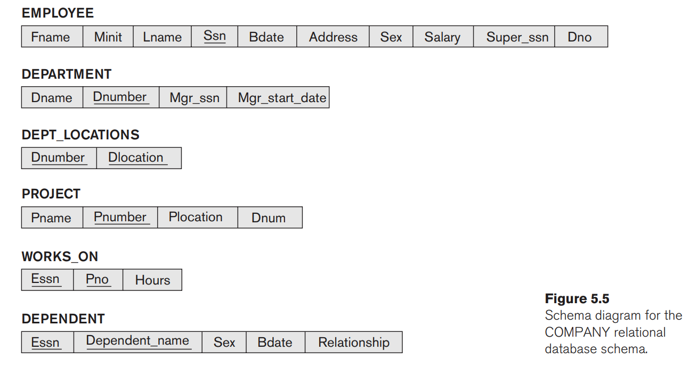

# Chapter 5 - The Relational Data Model and Relational Database Constraints

- Relational data model
	- uses the concept of mathematical relation to look like a table of values
	- theoretical bases in set theory and first-order predicate logic

## Relational Model Concepts

- relational model presents the database as a collection of results
- each relation looks like a table of values or a flat file
- A relation is a table of values
	- **row**: a fact that typically corresponds to a real-world entity or relationship
	- all values in one column are of the same data type
- formal relational model terms, 
	- a **row** is a tuple
	- **column** header is an attribute
	- **table** is relations
	- data type describing the type of values that can appear in each column => domain of values

### Domains, Attributes, Tuples, Relations

- a **domain** is a set of atomic values
	- atomic values: indivisible values
	- common way to specify domain -> set the data type from which to draw the values
	- **examples of domains**
		1. phone number: ten digit
		2. names: set of chars
- domain has given name, data type, and format (phone number, digits, (ddd) ddd-dddd)
- **Relation Schema** R denotes by $R(A_1, A_2, ..., A_n)$ is made up of a relation name and a list of attributes ($A$). 
	- each attribute $A_i$ is the name of the role played by some domain D in the relation scheme 
	- relation schema describes a relation
	- $R$ is its name
	- The **degree** (arity) of a relation is the number of attributes $n$ of its relation schema
	- Example```
		STUDENT(Name: string, Ssn: string, Home_phone: string, Address: string,Office_phone: string, Age: integer, Gpa: real)
- **Relation state** or **relation** $r$ of a relation schema $R(A_1, A_2,..., A_n)$ or $r(R)$ is a set of tuples $(t_1, ..., t_m)$
	- each $n$-tuple $t_i$ is an ordered list of $n$ values $t=<v_1,....,v_n>$
	- here, each value $v_i$ is an element of $dom(A_i)$ or special case $NULL$
	- $n$-th value in tuple $t_i$ (corresponding to attribute $A_i$) is $t[A_i]$, or $t_i$, $t.A_i$. 
	- relation intension or extension terms are also used


#### Formal

- A relationship $r(R)$ of degree $n$ on the domains $dom(A_1)$, ... $dom(A_n)$ is a subset of the Cartesian product$$r(R) \subseteq (dom(A_1) \times dom(A_2),..., \times dom(A_n))$$
- Total number of tuples in the Cartesian product of cardinality of domain 
	 $|D| = |dom(A_1)\ \times ... \times dom(A_n)|$
	 which represents all possible combinations while the **current relation state** reflects only the valid tuples that represent a particular state of the real world
 - schema do not change often, however, 
 - different domains can have the same domain

### Characteristics of Relations

The things that differentiate a file or a table from the relation
- **Ordering of tuples in Relation**: a relation is a set of tuples and there is no particular order and the relation is not sensitive to the ordering of tuples
- **Ordering of values within Tuple and alternate definition**
	 - it may seem order is important since a relation is an n-tuple, where tuples are ordered lists of n-values
	 - But order is not, as long there is some correspondence between attribute $(A_i)$ and value $v_i$
	 - So an alternative definition 
		 - a relation schema $R = \{A_1, ..., A_n\}$ and 
		 - a relation state $r(R)$ is a finite set of mappings $r=\{t_1, t_2, ..., t_m\}$ ..... missing
		 - so tuple is a set of $(<attribute>, <value>)$ pairs
 - Values and NULLs in Tuples
	- each value in a tuple is atomic and indivisible
	- also called the flat relational model
	- multi-valued attributes and composite attributes are not allowed
	- NULL values are used to describe unavailable or non-existent values
- Interpretation of relation
	- relation schema can be interpreted as a declaration or assertion
	- some relations describe facts about entities
	- other relation may describe facts about relations
## Relational Model Constraints 
- constraints that are inherent in the database => inherent or implicit constraints
- that can be explicitly expressed in schema (schema-based or explicit)
- that are only enforced by the application program and can not be expressed in schema (business rules or semantic constraints)
### Domain Constraints
1. within each tuple, the value of each attribute must be an atomic value drawn from $dom(A)$
### Key Constraints
1. no two tuples can have the same values
2. also, there are some subsets of attributes of a relation R with the property that no two tuples should have the same values of these attributes
	if a subset is SK then $t_1[SK] \neq t_2[SK]$
	and this set of attributes SK is called **superkey**
	- A superkey SK specifies a uniqueness constraint that no two distinct tuples in any state r of R can have the same value for SK. 
--- 
1. every relation has at least one default superkey
2. a superkey may have redundant attributes.
3. **key** k of a relation schema R is a superkey of R with additional properties: 
	- removing any attribute A from K leaves a set of attributes K' that is not a super key of R anymore
---
Hence, the key satisfies two properties
1. **Uniqueness** distinct tuples can not have the same values for all the attributes in the key
2. **Minimal Superkey**: a superkey from which we can not remove an attribute and still have the uniqueness property. 
So a key is a superkey but not vice versa. 
**example**:
1. Social security number is a key
2. car number and engine number can make up a key
---- 
- if a relation schema has more than one key, we call them candidate keys
- one key is designated as the primary key used to identify a tuple in the relation and is *underlined*
----
- Another constraint is whether the NULL value is permitted or not
### Relational databases and Relational Database Schemas
- A database consists of more than one relation and these relation's tuples are connected with each other in various ways. 

- **Relational database schema**: $S$ is a set of relational schemas $S=\{R_1, R_2, R_3, ..., R_m\}$ and a set of **integrity constraints** IC. 
- A relational database state DB of S is a set of relation states $DB = \{r_1, r_2,..., r_m\}$ such that each $r_i$ is a state of $R_i$ and satisfy integrity constraint



- Attributes in different relations should have different names (e.g., in the example above, SSN and Supervisor_SSN)
### Entity Integrity, Referential Integrity, and Foreign Keys
- **Entity integrity constraint** states that no primary key is NULL as they identify individual tuples in the relation
- referential integrity constraint: defined between two relations and is used to maintain consistency
	- **Informal:** A tuple in one relation that refers to another relation must refer to an existing tuple in that relation
----
A set of attributes FK in relation to schema $R_1$ is a foreign key of $R_1$ that references relation $R_2$ if it satisfies the following
	1. the attributes in the FK have the same domains as the primary key attributes of $R_2$
	2. A value of FK in a tuple $t_1$ of the current state $r_1(R_1)$ either occurs as a value of PK for some tuple $t_2$ in the current state $r_2(R_2)$ or is NULL. 
Here, $R_1$ is called referencing relation and $R_2$ is called referenced relation. 

**Example**: 
- Dno (The department number) in the above database is a foreign key of EMPLOYEE relation referencing the DEPARTMENT relation
- This means that a value of Dno in the tuple $t_1$ of the EMPLOYEE must match a value of the primary key of the DEPARTMENT

____
- A foreign key can also refer to its own relation
- all integrity constraints should be defined in the database schema
### Other types of constraints 
- Some constraints, called semantic constraints, are not part of Database Definition Language (DDL) and are enforced differently 
- **Example**: Employee salary in a range 
- These can be defined at the application level or by mechanism (constraint specification language) called triggers and assertions
## Update Operations, Transitions, and Dealing with Constraints Violations
Operations can be categorized into two groups: 
1. Retrievals
2. Updates
A relational algebra expression forms a new relation after applying a number of algebraic operators to an existing set of relations

----
Three basic operations that can change the state of relations
1. Insert: to insert one or more new tuple
2. update: modify some values of some attributes
3. Delete: to delete one or more tuples

when these operations are applied IC constraints must not be violated
### Insert Operation 
Insert operation provides a list of attribute values for a new tuple $t$. Insert operation can possibly violate all 4 constraints 
1. Domain constraint: value from not attribute domain or proper data type
2. Key constraints: if a key value already exists
3. Entity integrity: if any part of the primary key of a new tuple is NULL
4. Referential integrity: if the foreign key in t refers to a tuple that does not exist in the referenced relation 
### Delete Operation
- can violate any referential integrity: if the tuple being deleted is referenced by a foreign key from other tuples 
- Several options are possible if detection is rejected
	1. restrict: reject the deletion
	2. cascade: attempt to propagate the deletion by deleting tuples that reference the tuple being deleted
	3. set null or set default: modify the referencing attribute values that cause the violation
### The Update Operation 
modify values of one or more attributes in a tuple of some relation R. mandatory to specify condition 
- updating attributes that are not part of the primary or foreign key is not an issue, usually. 
- new value needs to be of the correct domain and data type
### The Transaction Concept
- A database application program running against a relation database usually executes one or more transactions 
- transaction is an executing program that includes some database operations (insert, deletion)
## Exercises

**5.11.** Suppose that each of the following Update operations is applied directly to the database state shown in Figure 5.6. Discuss all integrity constraints violated by each operation, if any, and the different ways of enforcing these constraints

1) Domain constraint error since `F` is not in the domain of Minit
```SQL
Insert 

<‘Robert’, ‘F’, ‘Scott’, ‘943775543’, ‘1972-06-21’, ‘2365 Newcastle Rd, Bellaire, TX’, M, 58000, ‘888665555’, 1>

into EMPLOYEE
``` 
2) `Insert <‘ProductA’, 4, ‘Bellaire’, 2> into PROJECT`
   Referential integrity since Dnum 2 does not exist in DEPT_LOCATIONS
4) `Insert <‘Production’, 4, ‘943775543’, ‘2007-10-01’> into DEPARTMENT`
   Key constraint error since key value 4 already exists
5) ` Insert <‘677678989’, NULL, ‘40.0’> into WORKS_ON.`
   No error
   6) Insert <‘453453453’, ‘John’, ‘M’, ‘1990-12-12’, ‘spouse’> into DEPENDENT.
      May be domain constraint error causes the spouse to be in lower case?
   7) 
