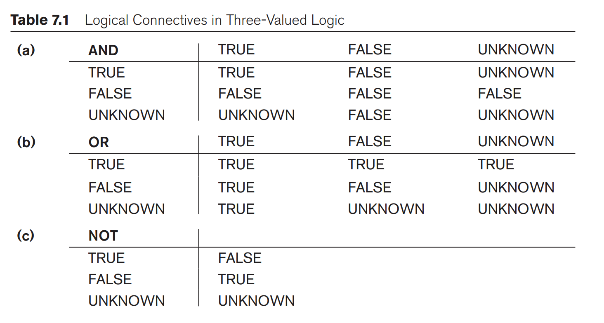

# hapter 7 - More SQL

## More complex SQL Retrieval Queries

### Comparisons involving NULL and Three-Valued Logic

- NULL has three different interpretations
	- value unknown (value exists but not known)
	- value not available: exists but purposefully withheld
	- value not applicable: attribute does not apply to this tuple
- Often not possible to determine the meaning intended so SQL does not distinguish between 3
- When a record with NULL in one of its attribute is involved in comparison, result is NULL (may be TRUE or FALSE), hence SQL uses three-way logic
	- TRUE
	- FALSE
	- UNKNOWN
- Due to this AND, OR, and NOT are different for SQL


- In `select-project-join` queries, only the True result of the WHERE expression is selected. False and Unknown are discarded. 
	- but there are some exceptions
- SQL has queries to check if a value is `NULL`, rather than `=` `<>`. this is because SQL considers each NULL to be different from other NULLs.
```SQL
	SELECT Fname, Lname
	FROM EMPLOYEE
	WHERE Super_ssn IS NULL;
```
### Nested Queries, Tuples and Set/Multiset Comparisons 
**Need for Nested Queries**: Some queries require existing values to be fetched first and then used for comparison conditions. These queries have a main query and an outer query.
- **Nested Complete** `select-from-where` block within SQL query. **Outer query**: can appear in `WHERE` or `FROM ` or `SELECT` clause or any other SQL clause as needed
```SQL
SELECT xxx
FROM xx
WHERE v IN (V)
```
- `IN` compares a value v with a set or multiset of values V and evaluates it to True if v is one of the elements in V. 
- A number of other comparison operators can also be used to compare a single value $v$ (typically an attribute name) to a set or multiset $v$ (typically called a nested query). 
	- `= ANY` and `=SOME` returns TRUE if the value v is equal to some value in the set V (equivalent to IN). ANY and SOME have the same effect
	- `ANY`, `SOME` can be combined with other comparison operators: $<, >, =, \leq, \geq, <>$
	- `ALL` can also be combined with all these. For instance, v > ALL V will return TRUE iff v is greater than all of the values in V
**Query**: return names of all the employees that have salaries higher than employees in department 5
```SQL
SELECT Name
FROM EMPLOYEE
WHERE Salary > ALL (SELECT Salary 
				   FROM EMPLOYEE
				   WHERE Dno='5'); 
```
**Query**: Reterive names  of each employee who has a dependent with the same first name and is of the same sex as the employee

```SQL 
SELECT E.Name
FROM EMPLOYEE as E
WHERE E.Ssn IN (SELECT SSN 
			   FROM DEPENDENT as D
			   WHERE E.Name=D.Name AND E.Sex=D.Sex )
```
### Correlated Nested Query
Whenever a condition in the `WHERE` clause of a nested query references some attribute of a relation declared in the outer query, two queries are said to be correlated. 

### `EXISTS` and `UNIQUE` functions 
- Boolean functions that return `TRUE` or `FALSE` and hence can be used in the WHERE clause. 
	- `EXISTS` to check if results of the nested query is empty or not
	**Query**: Reterive names  of each employee who has a dependent with the same first name and is of the same sex as the employee

```SQL
	SELECT E.Name
	FROM EMPLOYEE
	WHERE EXISTS (SELECT *
				  FROM DEPENDENT
				  WHERE E.Name=D.Name AND E.Sex=D.Sex )
	``` 
**Query** 6. Retrieve the names of employees who have no dependents.
```SQL
SELECT Name
FROM EMPLOYEE as E
WHERE NOT EXISTS (SELECT * 
				 FROM DEPENDENT as D
				 WHERE E.Ssn = D.Essn)
```
 **Query**: List the names of managers who have at least one dependent.
```SQL
SELECT FName, Lname
FROM EMPLOYEE as E
WHERE EXISTS (SELECT *
			  FROM DEPENDENT
			  WHERE E.Ssn = Essn)
	  AND
	  EXISTS (SELECT *
			  FROM DEPARTMENT
			  WHERE E.Ssn = Mgr_ssn)
```

**Query**  Retrieve the name of each employee who works on all the projects controlled by department number 5

```SQL
SELECT Fname, Lname
FROM EMPLOYEE as E
WHERE NOT EXISTS ((SELECT Pnumber 
			      FROM PROJECT 
			      WHERE P.Dnum=5)
			      EXCEPT (SELECT Pno
			              FROM WORKS_ON
			              WHERE Ssn=Essn))
```

### Explicit Set and Renaming in SQL 
- Possible to use an explicit set of values in the `WHERE` clause rather than nested query
**Query**: Retrieve the Social Security numbers of all employees who work on project numbers 1, 2, or 3
```SQL
SELECT DISTINCT Essn 
FROM WORKS_ON
WHERE Pno IN (1, 2, 3)
```
- Possible to rename any attribute in the result by adding the qualifier AS 
```SQL
SELECT E.Lname AS Employee_name, S.lname ...
```

### Joined Tables in SQL 
Tables can be joined and queried
```SQL
SELECT Fname, Lname, Address
FROM (EMPLOYEE JOIN DEPARTMENT ON Dno=Dnumber)
WHERE Dname='Research'
```
JOIN results in all the attributes of the first table, followed by all the attributes of the second table. 

- Possible to specify different types of JOIN
	- `NATURAL JOIN`: an implicit EQUIJOIN condition for each pair of attributes with the same name from R and S is created
	- If the names of join attributes are not the same then they can be renamed
```SQL
SELECT Fname, Lname, Address
FROM (EMPLOYEE NATURAL JOIN 
	 (DEPARTMENT AS DEPT (Dname, Dno, Mssn, Msdate)))
WHERE Dname='Research'
```
- Default is inner join which only includes tuple sthat match 
#### Outer Join
```SQL
SELECT E.Lname AS Employee_name, S.Lname AS Supervisor_name
FROM (EMPLOYEE AS E LEFT OUTER JOIN EMPLOYEE AS S ON E.Super_ssn=S.SSn)
```
- `INNER JOIN`
- `LEFT OUTER JOIN`
- `RIGHT OUTER JOIN`
- `FULL OUTER JOIN`
- multiway join is also possible where nested joins are used
```SQL
SELECT Pnumber, Dnum
FROM ((PROJECT JOIN DEPARTMENT ON Dnum=Dnumber)
	 JOIN EMPLOYEE ON Mgr_ssn = Ssn)
WHERE Plocatoin = 'Stafford';
```
### Aggregate Functions
- used to summarize information from multiple stupes into a single summary tuple
- Grouping is used to create sub-groups of tuples before summarization 
- Built-in
	- COUNT, MAX, SUM, MIN, AVG
- These functions can be used in the SELECT clause or HAVING clause
- Can be used in non-numeric tuples if domain values have a total ordering among one another. 
**Query**: Find the sum of the salaries of all employees, the maximum salary, the minimum salary, and the average salary.
```SQL
SELECT MAX(Salary) Max_salary, MIN(Salary) AS Min_salary, AVG(Salary) AS Min_salary
FROM EMPLOYEE
```
- `*` means rows so `COUNT(*)` will count tuples
- `COUNT` can also be used to count values in columns by using the column name
**Query** 23. Count the number of distinct salary values in the database.

```SQL
COUNT (DISTINCT Salary)
FROM EMPLOYEE;
```
- NULL values are discarded when aggregate functions are applied to columns, but  `COUNT(*)` is an exception
Applying in where clause
**Query**: retrieve the names of all employees who have two or more dependents 
```SQL
SELECT Fname, L.name
FROM EMPLOYEE
WHERE (SELECT COUNT(*)
	   FROM DEPENDENT 
	   WHERE SSn=Essn) >= 2;
```

- `SOME` and `ALL` are also aggregate functions that are used in SQL 
### Grouping: `GROUP BY` and `HAVING` Functions

- Aggregate function applied to a subgroup of tuples in a relation based on certain attributes
- To partition relation into nonoverlapping groups 
- `GROUP BY` clause specifies the grouping attributes which should also appear in the SELECT clause
**Query**: For each department, retrieve the department number, the number of employees in the department, and their average salary
```SQL
SELECT Dno, COUNT(*), AVG(Salary)
FROM EMPLOYEE
GROUP BY Dno;
```
- if NULL exists in the grouping, a separate group is created for all tuples with NULL. 

**Query:** For each project, retrieve the project number, the project name, and the number of employees who work on that project.

```SQL
SELECT Pno, Pname, COUNT(*)
FROM PROJECTS, WORKS_ONs
WHERE Pnumber=Pno
GROUP BY Pnumber, Pname
```

- To partition with conditions, the `HAVING` clause is used along with `GROUP BY`
**Query**: For each project on which more than two employees work, retrieve the project number, the project name, and the number of employees who work on the project.

```SQL
SELECT Pno, Pname, Count(*)
FROM PROJECTS, WORKS_ON
WHERE Pnumber=Pno
GROUP BY Pnumber, Pname
HAVING COUNT(*) > 2; 
```

- `WHERE` clause is executed first
## Specifying Constraints as Assertions and Actions as Triggers
Two additional features of SQL: 
	1. `CREATE ASSERTION`: additional types of constraints that are not possible to be written with built-in ones that are in [[Book Ch 5 - The Relational Data Model and Relational Database Constraints]]
	2. `CREATE TRIGGER`: specify automatic actions that the database system will perform when certain events or conditions occur
### Specifying General Constraints as Assertions in SQL 
- **When a constraint is violated:** whenever some tuple in the database causes the condition of an assertion to evaluate to `FALSE` 
- **Technique:** Write a query that selects tuples that violate the desired condition THEN, write it in `NOT EXISTS()`
	- query output must be empty
	- if not empty: violated
- CHECK clauses on individual attributes, domains, and tuples are only checked when tuples are inserted or updated in specific table
- **EXAMPLE**: salary must not be greater than the salary of the manager of the department that the employee works with 

```SQL
CREATE ASSERTION SALARY_CONSTRAINT
CHECK (NOT EXISTS (SELECT *
				   FROM EMPLOYEE E EMPLOYEE M,
						DEPARTMENT D
				   WHERE E.Salary > M.Salary
						 AND E.Dno = D.Dnumber
						 AND D.Mgr_ssn = M.Ssn))
```
### Introduction to Triggers in SQL
- `CREATE TRIGGER` to specify a certain action to take place when certain events are taking place
- Used to monitor database: for instance, inform manager when travel expense of employees exceeds a certain limit
**EXAMPLE**:
Inform the supervisor if an employee's salary is greater than their direct manager

```SQL
CREATE TRIGGER SALARY_VIOLATION
BEFORE INSERT OR UPDATE OF SALAR, SUPERVISOR_SSN
	ON EMPLOYEE
FOR EACH ROW
	WHEN (NEW.SALARY > (SELECT SALARY FROM EMPLOYEE
						WHERE SSN = NEW.SUPERVISOR_SSN))
						INFORM_SUPERVISOR(NEW.Supervsisor_ssn, New.Ssn)
```

## Views (Virtual Tables) in SQL 

### Concept of a View in SQL
- a single table derived from other tables. 
	- These other tables could be base or previously defined views
	- may not exist in physical form, considered virtual 
		- limits possible update operations that can be applied to the views
		- no limitations on querying a view
- view could be considered as a way to specify a table that we need to reference frequently, even tho does not exist physically 
- **EXAMPLE**: making a table view to get employee names and the projects they are working on, rather than needing to define it every time you need it
### Specification of Views in SQL 
- `CREATE VIEW` to specify a view
	- with a virtual (or view) name
	- a list of attributes 
	- a query to specify the content of the view
- if no new attributes (e.g, from arithmetic operations), don't have to specify new attribute names 
```SQL
CREATE VIEW WORKS_ON_1
AS SELECT Fname, Lname, Pname, Hours
	FROM EMPLOYEE, PROJECT, WORKS_ON
	WHERE Ssn = Essn AND Pno = Pnumber; 
```
OR 
```SQL
CREATE VIEW DEPT_INFO(Dept_name, No_of_emps, Total_sal)
AS SELECT Dname, COUNT(*), SUM(Salary)
	FROM DEPARTMENT, EMPLOYEE
	WHERE Dnumber=Dno
	GROUP BY Dname; 
```

- SQL queries can be executed on the views 
```SQL 
SELECT Fname, Lname
FROM WORKS_ON1
WHERE Pname='ProductX'
```

- views benefits
	- simplify queries 
	- used for authorization and security 
**Up-to-date**
- A view is supposed to be always update-to-date with respect to original tables
**Drop view**
- to dispose off a view
```SQL
DROP VIEW WORKS_ON;
```

### View Implementation, View Update, and Inline Views 
- efficient implementation of view is complex for DBMS, two main approaches
	1. **query modification**: to modify or transform a view query into a query on the underlying base table 
	2. **view materialization**: physically creating a temporary table when first queried and keeping 
		- an efficient strategy to keep the view up-to-date is necessary 
		- DMBS determines what new tuples must be inserted, deleted, and modified in a materialized view when the database is updated 
		- three different strategies to update the view
			1. immediate: whenever update done
			2. lazy: when an update is required by a query
			3. periodic: updating view after a specified interval of time
- retrieval query against a view is always possible
- update, insert, delete, command may or may not be possible 
	- view with a single defining table is updateable if the view attribute contains the primary key of the base relation 
	- view defined on multiple tables are generally not updateable
	- View defined using grouping and aggregate functions are not updateable 
- clause `WITH CHECK OPTION` should be added at the end of the view if the view should be updateable 
### Views as Authorization Mechanisms 
-  views can be used to hide certain *attributes or tuples* from unauthorized users 
- For instance, if a user is only allowed to view department 5, then it is possible to only allow them to query on the following view 
```SQL
CREATE VIEW DEPT5EMP AS 
SELECT *
FROM EMPLOYEE
WHERE Dno=5;
```

- by creating new views and granting access to only views (not base tables) can restrict users 

## Schema Change Statements in SQL
- can be done while the database is operational and do not require recompilation 
### The `DROP` Command 
- `DROP` command can be used to drop named schema elements, such as 
	- tables
	- types
	- constraints
	- whole schema: `DROP SCHEMA`
- Two options: 
	1. `CASCADE`: remove everything
	2. `RESTRICT`: only drop if it is empty
- `DROP TABLE` to remove a table
	```SQL
	DROP TABLE DEPENDENT CASCADE;
```
	- if `RESTRICT` is used, it will only be dropped IF it is not referenced in any constraints (e.g, foreign key reference in another table)
	- with `CASCADE`, all references (e.g., tables, views, constraints) are also dropped
- `DROP TABLE` also removes table definition in the catalog
- `DELETE` command if only need to delete table and not the definition
### The `ALTER` Command
- to change definition of a base table or other named schema elements
- alter table actions
	- adding or dropping a column (attribute)
	- changing a column definition 
	- add or drop constraints
- **EXAMPLE**: add an attribute for keeping track of jobs of employees for the EMPLOYEE base table
	```SQL 
ALTER TABLE COMPANY.EMPLOYEE ADD COLUMN Job VARCHAR(12)
```
- new values for new attributes must be added individually 
	- either by specifying a default clause
	- or by UPDATE command individually on each tuple [[Book Ch 6 - Basic SQL]]
- If no default value is specified, then `NULL` will be added (hence NOT NULL constraint is not allowed)
- possible to alter the definition of a column by dropping an existing default clause and adding a new
```SQL
ALTER TABLE COMPANY.DEPARTMENT ALTER COLUMN Mgr_ssn DROP DEFAULT;

ALTER TABLE COMPANY.DEPARTMENT ALTER COLUMN SET DEFAULT '33232323'
```
- adding or changing named constraint 
```SQL
ALTER TABLE COMPANY.EMPLOYEE
DROP CONSTRAINT EMPSUPEREF CASCADE
```