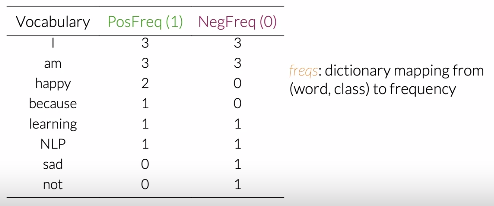
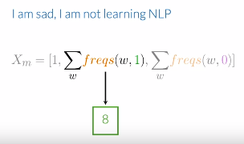

# Week 1: Welcome to NLP

### How to represent words 

Sentence: [W1, W2, W3, ... Wn]

1. **One Hot**: Each word as one-hot vector, each word's dim = Vocab size

2. **Frequency based** : Count appearance of each word in the data. 

   

      Representation: NegFreq of words appearing in class 1, ...n
   	

   ### Preprocessing 

   1. Remove Stop Words
   2. Stemming: Convert words to their roots 
   3. Lowercase

   ### Logistic Regression 

   $$
   h(x, \theta) = \dfrac{1}{1+e^{-\theta x}}
   $$

   

# Week 2: Naive Bayes 

- It uses Bayes Rule

$$
P(y|x) = \dfrac{P(x|y)P(y)}{P(x)}
$$

- This is how we will calculate conditional probabilities: 

  

- Applying Naive Baye's: Finding ratio of conditional probabilities. 
  

- **Laplacian Smoothing **: To avoid zeros and thereby probability being zero, we add 1 for each frequency.
  
-  To avoid numerical unstability, we use log: 
  
- 