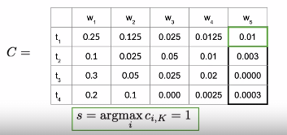

# Part of Speech Tagging

- parts of speech 
  

## POS as Markov Process

- POS tag of word depends on the POS tag of pervious word in the sentence and can be shown as Markov Chain:
  
- Probability of POS Tag of word only depends on the last word so we can represent it with a transition matrix representing transition probabilities. Each row should add up to 1.
  
- We can cater first word by adding an initial state: Now the transition matrix is a n+1 x n matrix.
  

## Hidden Markov Model

- Definition from Wikipedia:
  

- Example:
  

- In POS Tag: 

  - Y: words are observable states
  - X: POS Tags are unobservable hidden states

- The Hidden Markov models have two transitions matrices given as follow:

  - Transition probabilities: from one POS to next POS
    

  - Calculating transition probabilities:  
    
    Smoothing:
    

    No smoothing to initial probabilities as it can allow any part of speech being first word. 

  - Emission Probabilities: transition from hidden states to observable states i.e. POS Tag --> Word

    count of co-occurrence of a word with POS.
    

    

    Summary:

  

##  Viterbi Algorithm 

Hidden Markov model gives us a way to estimate the probability of next word given previous word or POS. Viterbi algo makes it possible to create POS map for a complete sentence.

Three steps: i) initialization ii) forward iii) backward

Assuming a K word sentence and N types of POS.

### Initialization

C matrix represents probability from each possible to each word in our sentence.  In this step, we populate first column.  

In D, we store labels that represents different states you are traversing when finding the most likely sequence of POS given sequence of words. 

### Forward Pass

During the forward pass, entries of the matrix C and D are populated column by column. 

### Backward Pass

Track the pass through the matrix D that represents most probable sentence. Start from the last word and find the index of highest probability in matrix C:

This  index shows POS of last word in matrix D.

From there backtrack by looking at the column given in pervious word's index as follows:

#### Implementation Details

