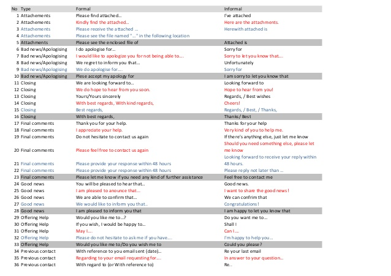

# Write Professional Emails in English

[TOC]

## Basic Structure 

- **Subject line**: clear purpose, brief (50 characters or less)
- **Greeting**: formal, appropriate reader
- **Email Text**: introduction-development-conclusion, 3-4 sentences/paragraph
- **Closing**: simple, full name

**Basic Structure of Email**

1. **Subject Link**: Introduce topic of email with clear words

   Should use correct (spell, grammar, punctuation)

2. **Greeting**

   1. If you know the person, add specific greetings 
   2. Non-gender specific if don't know it
   3. If addressing a group, you can use: To whom it may concern

3. **Email Text**

   1. Don't write long email. Brief (1-4 paragraphs with 3, 4 sentence each para)

   2. 1, 2 request at most
   3. Don't blame other, blame situation if needed
   4. Add words of thanks

4. **Closing**

   1. Regards
   2. Best Regards
   3. First Name
   4. Extra contact info
   5. No extra  title etc. 

**Dos and Don'ts **

1. A professional looking email like first_name.second_name@mail.com
2. Do consider cultural differences 
3. Do add words of appreciation 
4. Don't blame, if required self-blame e.g. My package was late. 

## Organization Style and Editing Basics 

- be brief and clear

- carefully think about what you want to say and say it briefly

  > writing is 1% writing 99% elimination 

- Stick to your words, own message and only what needed to say

- Use only words that are necessary. 

- Don't use passive wise.

#### Be Clear

1. Keep things in order
2. Be precise with most important information 

3. Avoid strong words like and use neutral words
   1. Must 
   2. should 
   3. demand 
   4. require
   5. Necessity

## Common Punctuation Errors

6 commons errors

1. Apostrophe `'`: It used for possession. Do not use "can't"
2. Exclamation`!`: never use it in professional email
3. Comma `,`: 
   1. Read out loud to see where it should be. If you have to pause, use comma. 
      
   2. use it with list.
   3. set of Geographical names: Paris, France.
   4. Dates except month and day: October 10, 2011.
   5. Titles: Awais, Ph.D.
   6. [Owl website](https://owl.english.purdue.edu/) is good resource 
4. Semicolon `;`: should almost never use it. If you are in doubt, don't use it. You can use with series
5. Quotation `"..."`: should never be used for emphasis. Should use when quoting someone and use it rarely. 
6. Emoticons `:)`: Don't use them.

#### Errors in Punctuation 

1. Proper nouns
2. Start of sentence 
3. don't confuse title with the occupation: President Obama vs president visited a place.
4. Don't capitalize prepositions: Lord of the Rings

#### Resources 

1. https://owl.english.purdue.edu/
2. This section of owl website for punctuation: [Punctuation](https://owl.purdue.edu/owl/general_writing/punctuation/punctuation/index.html)

## Writing Effective Subject Line

- subject line should catch reader's eye
  - make it brief: 50  characters or less (5-7b words) but better 2-4 words
  - Include keywords put important words at the start. 
    - When Introducing: Introduction - Awais
    - When applying : Job Application - Awais
    - When requesting  Meeting: Meeting Request
- Make it Direct
  - Job Application - Awais, Ph.D.
- Use Action works: Grand Opening, Try ABC's 
- Meeting Request : December 12, 2018

## Email Text

- 3 essential parts
  - **introduction**: who is writing and what is the purpose. Should be first sentence. 
    - Name position and location if first time else just use noun like I am delighted to inform you. 
    - Controlling Idea = Purpose: What you need to accomplish with the email: 
  - **Development**: Develop the purpose of email. Ask WH question for what email is about?
  - **Conclusion**: One sentence: should use words of appreciation e.g. "Thank you for your interest in our Z."

#### Resources 

**More complete list of general advice about emails in the 21st Century** (http://www.inc.com/guides/2010/06/email-etiquette.html)

**Job Application Email (**http://www.manchester.edu/OSD/Career/documents/EmailEtiquette09.pdf).

## Different Types of Email
### Introduction Emails
- Clear Subject line explaining the purpose 
- Body: how do you be a good match and why meeting you would be good for them. Why is it good for someone to meet you.
#### Key language for introduction

- self introduction 

  - subject line and greeting as usual
  - Email Text: Introduction sentence (who is sending the email), controlling idea, development, conclusion.
  - Introduction: e.g. My name is x and I am with y.
  - Controlling Idea: why you are sending the email e.g. I am in your area and want to meet
  - Development: WH questions for readers and answer them. (who can create an online course?)

- Sample Email for personal introduction from [Lifehacker](https://lifehacker.com/this-template-makes-introduction-emails-easier-1716092031), [More Details](https://www.themuse.com/advice/introducing-the-email-template-thatll-get-you-a-meeting-with-anyone-you-ask)

  > Dear [first name],
  > My name is <u>[your name]</u>, and I’m a <u>[job title]</u> who works in [your location]. I’m reaching out because <u>[reason why you want to speak with this person]</u>. I’d love to learn more about <u>[two or three things you’d like to learn from the person]</u>.
  >
  > I’m sure you’re busy, so even 20 minutes would be appreciated.
  >
  > Thanks so much,
  >
  > <u>[Your name]</u>

Introduction to another person Email: 

- - subject line: Meet sara
  - controlling idea: I would like to introduce you to sara
  - development: more info about the person.

### Announcement Emails
- Tell something that is new to them
- clear and accurate information 
- Try to answer all the questions in the email

#### Language

- Introduction: more bold and attractive and direct
- specific information: should include who, what, why and other details
- end with positive note and your signature 

Sample promotional emails: [Announcement email](https://www.getvero.com/resources/guides/lifecycle-marketing/promotional-emails/)

## Request and Apology Emails

- How to say things politely and more sincerely instead of being direct.
- Use words please and question form: would be could be.
### Request Emails
- Respectful and polite language
	- simplest: use word 'please'
	- by using question form could, would : could you please send me your resume.
	- use please before verb
	- use expression would you mind: would you mind giving me your directions 
	- would like (=polite form of want) e.g. I would like to meet you on Friday
- making second request
	- use word also
	e.g. please send your resume. Could you alsos include three references. 
- conclusion
	- simple: thanks
	- Thank + reason for thanks 
		1. Thank you for + your + Noun
		e.g. Thank you for your time and effort
		2. I appreciate + your + Noun
		e.g. I appreciate your time and effort
	
### Apology Emails 
- different expressions are used based on level of responsibility 
	- I'm sorry about
	- I'm sorry if
	- I'm sorry for
- I'm sorry if+description: when not sure the level of responsibility 
- I'm sorry that + description: when you are sure you are responsible. Follow up with clear description of action to clear the issue
- I'm sorry about+Noun: for small hiccups, when you don't need to give detailed description in detail. 
	- I'm sorry about the inconvenience caused. 

### Resources
1. Making requests more polite: [link](https://www.bloomsbury-international.com/images/ezone/ebook/how-to-apologise.pdf)
2. More general information about request as well as some on suggestions: [link](http://www.grammar-quizzes.com/modal5.html)
3. How to apologize in English: [link](https://www.bloomsbury-international.com/images/ezone/ebook/how-to-apologise.pdf)

## Culture, Gender and Age Considerations 

### High Low context Communication 

- Different culture considerations 
- Low context communication (North America and West Europe)
	- straight forward  ==   Logic 
	- concise                  ==   Facts
	- Efficient                 ==   Directness
- High Context Culture (middle east, Asia,  Africa, South America)
	- Non-explicit
	- Descriptive
	- Long emails 
- Low Context Writer -> High Context Reader
	Status and identity need acknowledgement 
	Building a good relationship is important 
- High Context Writer -> Low Context Reader
	1. efficiency and effectiveness through tasks
	2. Direct questions are used for clarity 
- High Context Culture Email Example

### Age and Gender Considerations 
- Age and gender effect communication especially in high cultures 
- Age considerations
	- use respect terms or official terms
	- Don't use slang words or pop culture 
- If don't know about culture, be gender neutral. 

###  Resources
1. High/Low culture: 
	1. http://www.culture-at-work.com/highlow.html
	2. http://www.marin.edu/buscom/index_files/Page605.htm

## A List of Formal and Informal Phrases 

Informal/Formal phrases ([reference](http://image.slidesharecdn.com/keyphrasesformalinformalforemail-131106220315-phpapp02/95/key-phrases-formal-informal-for-email-1-638.jpg?cb=1383775514)): 
 

